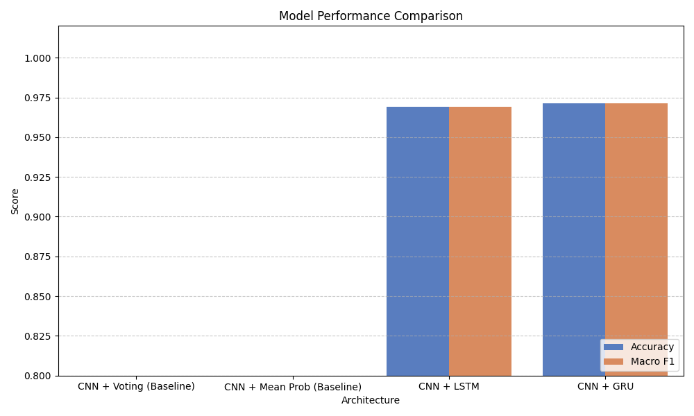
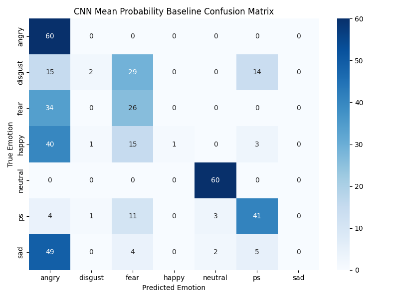
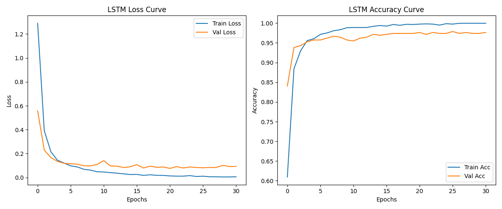
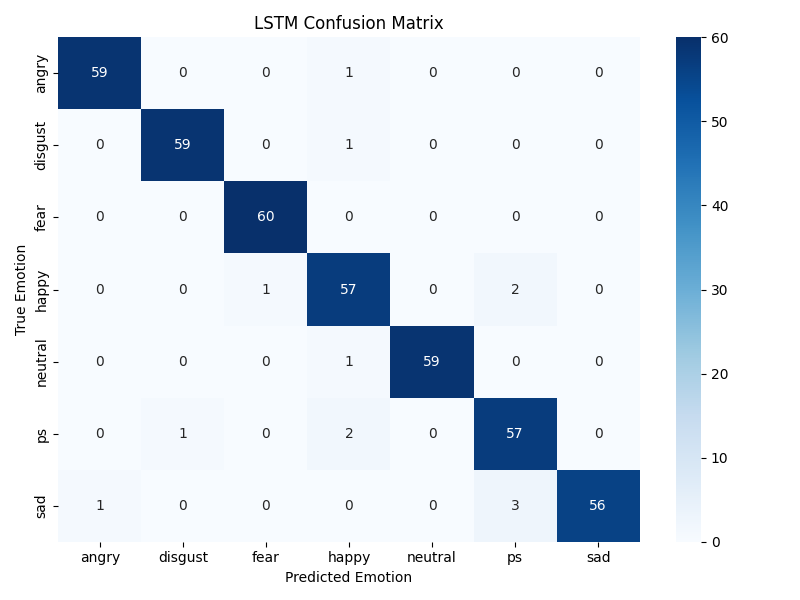
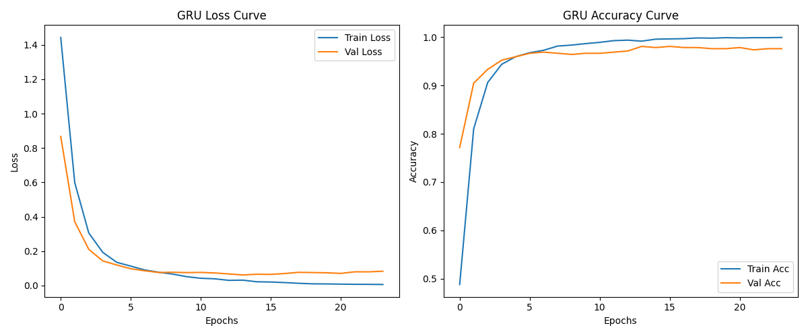
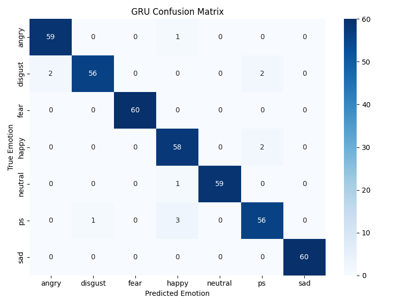

# AudEmo — Long-Form Speech Emotion Recognition

AudEmo is a deep learning-based **Speech Emotion Recognition (SER)** system that evolved from a CNN classifier into a **long-form temporal emotion recognition system using CNN + GRU**.

The system processes long-form speech into sequential audio chunks, extracts acoustic features using CNN, models their temporal relationships using GRU, and visualizes how emotion changes throughout the recording.

---

## Project Evolution

### Phase 1 — Original CNN Model

The initial version of AudEmo classified emotions directly from individual speech recordings using **Log-Mel Spectrograms + CNN**.

```text
Audio
  ↓
Log-Mel Spectrogram
  ↓
CNN
  ↓
Emotion Classification
```

Supported emotions:

* Angry
* Disgust
* Fear
* Happy
* Neutral
* Pleasant Surprise
* Sad

The original model achieved approximately **99% accuracy** on the TESS dataset.

---

### Phase 2 — Long-Form Emotion Recognition

The project was extended to handle longer audio by modeling emotion across time.

```text
Long Audio
    ↓
Resample to 16 kHz
    ↓
1.0s chunks
    ↓
0.5s overlap
    ↓
Log-Mel Spectrogram
    ↓
Existing CNN
    ↓
128-Dimensional CNN Embedding
    ↓
Sequence Construction
    ↓
Padding + Masking
    ↓
GRU
    ↓
Softmax
    ↓
Overall Emotion
```

Two temporal architectures were evaluated:

* CNN + LSTM
* **CNN + GRU**

After comparison, **CNN + GRU was selected as the final architecture**.

---

## Dataset

AudEmo uses the **Toronto Emotional Speech Set (TESS)**.

Dataset statistics:

| Property               |     Value |
| ---------------------- | --------: |
| Total audio files      |     2,800 |
| Emotion classes        |         7 |
| Speakers               |         3 |
| Samples per emotion    |       400 |
| Original sample rate   | 24,414 Hz |
| Processing sample rate | 16,000 Hz |
| Mean audio duration    |  2.06 sec |

### Dataset

Download the dataset from Kaggle:

**https://www.kaggle.com/datasets/ejlok1/toronto-emotional-speech-set-tess**

After downloading, place it in:

```text
TESS Toronto emotional speech set data/
```

---

## Data Splitting & Leakage Prevention

The dataset is split at the **original audio-file level before chunking**.

```text
2,800 audio files
       ↓
Train      1,960 (70%)
Validation   420 (15%)
Test         420 (15%)
```

This prevents chunks from the same recording from appearing in multiple datasets.

A disjoint-split assertion is also performed during sequence generation.

---

## CNN + LSTM vs CNN + GRU

Both temporal models were trained under the same experimental conditions using the same CNN embeddings and dataset split.

| Model                  | Test Accuracy |   Macro F1 | Parameters | Training Time |
| ---------------------- | ------------: | ---------: | ---------: | ------------: |
| CNN + Voting           |        40.48% |     34.40% |          — |             — |
| CNN + Mean Probability |        45.24% |     36.27% |          — |             — |
| CNN + LSTM             |        96.90% |     96.92% |     49,863 |        13.61s |
| **CNN + GRU**          |    **97.14%** | **97.15%** | **37,703** |    **10.06s** |

### Selected Architecture: CNN + GRU

CNN + GRU achieved the best overall results:

* **97.14% Test Accuracy**
* **97.15% Macro F1**
* **24.3% fewer parameters than LSTM**
* **~26% faster training than LSTM**

Therefore, **CNN + GRU is the final production architecture used by AudEmo**.



---

## Why Temporal Modeling?

Simple CNN aggregation performed poorly on the chunk-level representations.

```text
CNN + Voting          → 40.48%
CNN + Mean Probability → 45.24%
CNN + LSTM            → 96.90%
CNN + GRU             → 97.14%
```

The original CNN was trained on complete short recordings, while the long-form pipeline feeds it shorter overlapping chunks. The chunk-level predictions are therefore noisy.

Instead of relying directly on individual predictions, CNN embeddings are passed as an ordered sequence to the GRU, allowing the model to learn **temporal relationships between acoustic segments**.

---

## Final Architecture

```text
                 LONG-FORM AUDIO
                       │
                       ▼
               Audio Preprocessing
                 16 kHz Resampling
                       │
                       ▼
            1s Chunks / 0.5s Overlap
                       │
                       ▼
               Log-Mel Spectrogram
                    128 × 128
                       │
                       ▼
                 Existing CNN
                       │
                       ▼
             128-D Feature Embedding
                       │
                       ▼
               Sequence Construction
                       │
                       ▼
               Padding + Masking
                       │
                       ▼
                  GRU — 64 Units
                       │
                       ▼
                   Dropout
                       │
                       ▼
                Dense + Softmax
                       │
                       ▼
               Overall Emotion
```

---

## Project Structure

```text
AudEmo/
│
├── 01_data_preparation.py
├── 02_data_splitting.py
├── 03_model_training.py
├── 04_model_evaluation.py
│
├── 04_sequence_generation.py
├── 05_train_lstm.py
├── 06_train_gru.py
├── 07_evaluate_models.py
├── 08_compare_models.py
│
├── predict_long_audio.py
├── test_predictions.py
├── web_server.py
├── requirements.txt
│
├── best_model.h5
├── best_model.keras
│
├── processed_data/
│   ├── features.pkl
│   ├── labels.pkl
│   ├── label_encoder.pkl
│   ├── sequence_metadata.pkl
│   ├── X_train_seq.npy
│   ├── X_val_seq.npy
│   ├── X_test_seq.npy
│   ├── y_train_seq.npy
│   ├── y_val_seq.npy
│   ├── y_test_seq.npy
│   └── ...
│
├── results/
│   ├── cnn_baseline/
│   ├── cnn_lstm/
│   ├── cnn_gru/
│   └── comparison/
│
├── static/
│   ├── app.js
│   └── styles.css
│
├── templates/
│   └── index.html
│
├── test_data/
│
├── uploads/
│
└── TESS Toronto emotional speech set data/
```

---

## Experiment Results

### CNN Baselines



### CNN + LSTM





### CNN + GRU





---

## Long-Form Inference

The `predict_long_audio.py` script performs the complete inference pipeline on a long audio file.

```bash
python predict_long_audio.py --file "path/to/audio.wav" --model gru
```

The pipeline:

```text
Audio
  ↓
Chunking
  ↓
CNN Embedding Extraction
  ↓
Sequence Construction
  ↓
CNN + GRU
  ↓
Overall Emotion
```

---

## Web Application

AudEmo also includes a web interface built around the **CNN + GRU** model.

```text
Upload Long-Form Audio
          ↓
Automatic Preprocessing
          ↓
CNN Feature Extraction
          ↓
GRU Temporal Analysis
          ↓
Overall Emotion + Confidence
          ↓
Emotion Timeline
          ↓
Spectrogram-Style Visualization
```

The interface allows users to upload long-form audio and visually inspect how predicted emotions change across the recording.

Different emotion regions are highlighted using different colors, while the audio player and timeline are synchronized to allow inspection of specific segments.

### UI Design

The application follows a **Neo-Brutalist** visual style with restrained use of:

* Glassmorphism
* Soft 3D
* Modern gradients
* Subtle depth

The goal is to make the system feel like a premium AI analysis product rather than a conventional ML dashboard.

---

## Installation

Clone the repository:

```bash
git clone https://github.com/username/AudEmo.git
cd AudEmo
```

Install dependencies:

```bash
pip install -r requirements.txt
```

Make sure the TESS dataset is available at:

```text
TESS Toronto emotional speech set data/
```

---

## Running the Original CNN Pipeline

```bash
python 01_data_preparation.py
python 02_data_splitting.py
python 03_model_training.py
python 04_model_evaluation.py
```

---

## Running the Long-Form Pipeline

### 1. Generate sequences

```bash
python 04_sequence_generation.py
```

### 2. Train LSTM

```bash
python 05_train_lstm.py
```

### 3. Train GRU

```bash
python 06_train_gru.py
```

### 4. Evaluate baseline models

```bash
python 07_evaluate_models.py
```

### 5. Compare models

```bash
python 08_compare_models.py
```

---

## Running the Web Application

```bash
python web_server.py
```

Then open the local URL shown by the Flask server in your browser.

---

## Technologies

**Python · TensorFlow/Keras · CNN · GRU · LSTM · Librosa · NumPy · Scikit-learn · Matplotlib · Flask · HTML · CSS · JavaScript**

---

## Final System

AudEmo evolved through the following timeline:

```text
Short-form CNN Emotion Recognition
                ↓
       Dataset Processing
                ↓
        Long-form Chunking
                ↓
      CNN Feature Embeddings
                ↓
       LSTM vs GRU Evaluation
                ↓
          CNN + GRU Selected
                ↓
     Long-form Audio Inference
                ↓
      Interactive Web Application
                ↓
       Emotion Timeline Analysis
```

The final system focuses on one key idea:

> **Emotion is not static — it evolves across time.**

**AudEmo — From audio classification to temporal emotion understanding.**
